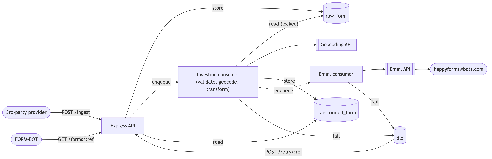

# Health Form Ingestion

Author: Fi McAfee

## Solution Overview



## Running locally

Requires Docker and Docker Compose.

```bash
docker compose up --build   # starts Postgres, Tempo, Grafana, and the app (app on :3000)
docker compose down         # stop (add -v to also drop the Postgres/Tempo volumes)
```

The app runs its own schema migrations on startup, so there's nothing else to set up.


### Example requests

```bash
# Ingest a form (fire-and-forget - processing happens asynchronously)
curl -X POST http://localhost:3000/ingest \
  -H "Content-Type: application/json" \
  -d @src/forms/examples/person_one.json

# Read back the transformed form once processing completes
curl http://localhost:3000/forms/GRU-123089-2026

# Check the dead-letter queue for a failed form
curl http://localhost:3000/dlq/GRU-123089-2026

# Retry a DLQ'd form (e.g. after a transient provider error, or a code fix for a schema issue)
curl -X POST http://localhost:3000/retry/GRU-123089-2026
```

Two scripts wrap the above into end-to-end demos, including polling for the async result:

```bash
./scripts/ingest-example.sh   # happy path: ingest -> validate -> geocode -> store
./scripts/dlq-example.sh      # failure path: schema violation -> non-retryable DLQ
```

### Tracing

The app is instrumented with OpenTelemetry and exports traces via OTLP to a local [Grafana
Tempo](https://grafana.com/oss/tempo/) instance, viewable in Grafana:

1. `docker compose up --build`
2. Exercise the API (e.g. `./scripts/ingest-example.sh`)
3. Open [http://localhost:3001/explore](http://localhost:3001/explore) (no login required), pick the
   **Tempo** datasource, and search - e.g. TraceQL `{resource.service.name="take-home-test"}`

A single `POST /ingest` produces one connected trace spanning the whole pipeline: the HTTP
request, the `ingestion.process` job (running later, on pg-boss's polling loop), and the
`email.process` job it triggers - each a child of the last, with `db.query` and
`geocode.lookupPostcode` nested underneath.
